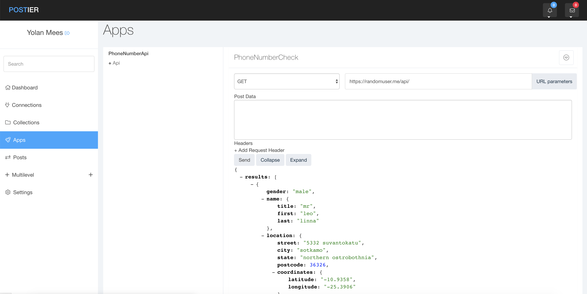

# postier
Postier is an API automation platform, link and sync all your applications and send data to a database or google sheet.

inport all your APIs and connect them together, get data, transform data and resend the data to somewhere else.

## working features
- Import Postman collection V1
- Create/Save Http requests via UI
- collection manager v1

## Coming features
- Default applications
- Transformers
- Advanced workflow builder
- collection manager v2
- drag and drop ui for workflows

## Installation
`cd <app dir>`

`composer install`

`php artisan migrate`

## screenshot

## Contribute
Those who are interested may always give themselves up to contribute to Postier through our Facebook group
https://www.facebook.com/groups/222905358270555/
